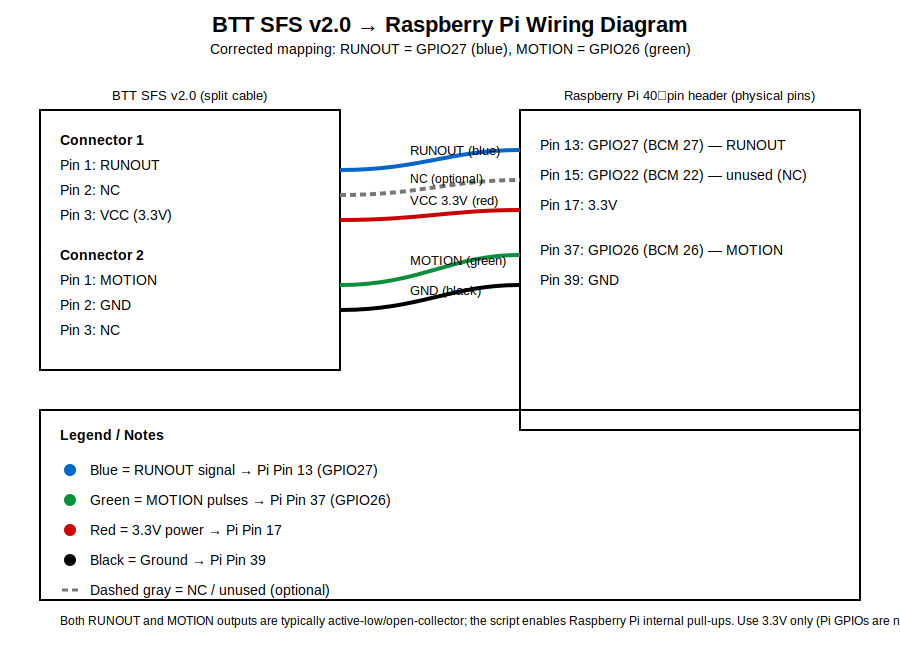

# BTT SFS v2.0 Jam Monitor for Prusa Core One (Stock Firmware)

A Raspberry Pi–based filament jam monitor using the **BTT SFS v2.0** optical wheel sensor.

This project is designed to work **strictly with stock Marlin-based firmware** and **PrusaConnect streaming**, with **no firmware modification**, **no Klipper**, and **no host-side G-code parsing**.

When a filament jam is detected, the script triggers a clean **`M600` filament change**, allowing the user to clear the jam and resume the print safely.

---

## Key Features

- ✅ Works with **stock firmware only**
- ✅ Compatible with **PrusaConnect streaming**
- ✅ No G-code parsing required
- ✅ Uses real filament motion (encoder pulses), not heuristics
- ✅ Clean recovery using **`M600`**
- ✅ Script is fully external and non-invasive
- ✅ Optional **self-test mode**
- ✅ Optional **automatic re-arm after resume**

---

## System Architecture (Important)

- PrusaConnect streams G-code over the network
- The Raspberry Pi **does NOT see outgoing G-code**
- The Pi **only sees printer → host serial output**
- Therefore:
  - Plain G-code comments (`// ...`) are invisible
  - **`M118` messages must be used** as control markers

---

## Hardware Requirements

### Required
- **Prusa Core One** (or compatible Prusa machine)
- **Stock Prusa / Marlin-based firmware**
- **BTT SFS v2.0 filament sensor**
- **Raspberry Pi** (any model with GPIO)
- USB cable from Pi → printer (USB-C on Core One)

### Electrical Assumptions (Critical)
- SFS v2.0 pulse output is **open-collector / open-drain**
- Raspberry Pi **internal pull-up is required**
- Signal idles **HIGH** and pulses **LOW** (active-low)
- GPIO numbering uses **BCM mode**

---

## Wiring

| SFS v2.0 Pin | Raspberry Pi |
|-------------|--------------|
| VCC         | 5V or 3.3V (per SFS spec) |
| GND         | GND |
| PULSE       | GPIO **26** (BCM) |

⚠️ Ground **must** be shared between SFS and Pi.

---

## Software Installation (Raspberry Pi)

### 1. Install dependencies
```bash
sudo apt update
sudo apt install -y python3 python3-pip
python3 -m pip install pyserial gpiozero
```

### 2. Copy the script
Save the script as:
```text
sfs-monitor.py
```

Make it executable:
```bash
chmod +x sfs-monitor.py
```

---

## PrusaSlicer Configuration (REQUIRED)

⚠️ **This step is mandatory.**  
The monitor relies on `M118` markers echoed back by firmware.

### Printer Settings → Custom G-code

#### Start G-code
```gcode
M118 A1 sensor:reset
M118 A1 sensor:enable
```

(Optional comments for readability)
```gcode
// sensor:reset
// sensor:enable
```

#### End G-code
```gcode
M118 A1 sensor:disable
```

(Optional)
```gcode
// sensor:disable
```

### ⚠️ Do NOT put `sensor:reset` here:
- Pause Print G-code
- Filament Change G-code
- Toolchange G-code

Resetting during pause is unsafe and can cause false re-arming.

---

## Self-Test Mode (Highly Recommended)

Run this **before trusting the system**.

```bash
python3 sfs-monitor.py -p /dev/ttyACM0 --self-test
```

What it tests:
- ✔ Serial communication
- ✔ Firmware echo of `M118`
- ✔ GPIO wiring
- ✔ SFS pulse generation

---

## Normal Operation

```bash
python3 sfs-monitor.py -p /dev/ttyACM0 --auto-reset --reset-pulses 1.5 --quiet-temps
```

---

## License / Use

Personal / experimental use.

---

## Filament Runout Input (GPIO 27)

The BTT SFS v2.0 provides a **runout switch output** (simple on/off signal) in addition to the motion pulses.

### Wiring

- Runout signal → Raspberry Pi **GPIO 27** (BCM numbering)
- GND → Raspberry Pi **GND** (shared ground)

Defaults assume **active-low** (common open-collector to ground), so the Pi enables an internal pull-up and treats **LOW = runout**.

If your runout output is active-high, run with:
```bash
--runout-active-high
```

### Behavior

- Runout triggers an immediate pause action (default `M600`), independent of the jam “armed” state.
- Input is debounced (`--runout-debounce`, default 0.10s).

Disable runout monitoring if needed:
```bash
--no-runout
```

---


### Runout Test Mode

To verify the runout switch wiring and polarity without touching the printer/serial port:

```bash
python3 sfs-monitor.py --runout-test --runout-gpio 27
```

- The script prints `RUNOUT asserted=True/False` whenever the GPIO state changes.
- Default assumes **active-low** (LOW = runout) with a pull-up enabled.
- If your signal is active-high, add:

```bash
python3 sfs-monitor.py --runout-test --runout-gpio 27 --runout-active-high
```

---

## CLI: Status and Version

Print the tool version:

```bash
python3 sfs-monitor.py --version
```

Print a one-shot status report (useful for systemd/SSH debugging):

```bash
python3 sfs-monitor.py -p /dev/ttyACM0 --status
```

You can also see example commands in:

```bash
python3 sfs-monitor.py --help
```

---

---

## Wiring Diagram

This project uses the BTT SFS v2.0 split cable with:

- **RUNOUT** on **GPIO27 (BCM 27)** — *blue wire* — **Raspberry Pi physical pin 13** (Connector 1 pin 1)
- **MOTION** on **GPIO26 (BCM 26)** — *green wire* — **Raspberry Pi physical pin 37** (Connector 2 pin 1)
- **VCC** to **3.3V** — **Raspberry Pi pin 17** (Connector 1 pin 3)
- **GND** to **GND** — **Raspberry Pi pin 39** (Connector 2 pin 2)

> Note: Connector 1 pin 2 and Connector 2 pin 3 are NC. If you physically land NC on Pi pin 15, it is unused.

### Printable diagram files

- `sfs_rpi_wiring_diagram.svg` (recommended for printing)
- `sfs_rpi_wiring_diagram.png` (easy preview)

### Preview

GitHub renders SVG directly:




---

## PrusaSlicer Start G-code Integration

The monitor is controlled via G-code comments sent over the serial console using `M118 A1`.
These comments are ignored by stock Marlin but are parsed by the monitor.

### Required Start G-code additions

#### Enable the monitor
Add this **after** setting extruder mode (e.g. after `M83`):

```gcode
M118 A1 // sensor:enable
```

#### Reset the monitor before first extrusion
Add this **immediately before the purge sequence**, before the first `G92 E0`:

```gcode
M118 A1 // sensor:reset
```

This guarantees:
- no stale latch from a previous print
- first purge pulses are treated as valid motion
- jam detection starts in a clean state

### Example placement (excerpt)

```gcode
M83 ; extruder relative mode
M118 A1 // sensor:enable

...

M109 S{first_layer_temperature[0]}
M118 A1 // sensor:reset
G92 E0
```


---

## Additional CLI Utilities

### JSON status output

For machine-readable status (useful for scripts or monitoring):

```bash
python3 sfs-monitor.py --status --json
```

This outputs a single JSON object describing:
- enabled / latched state
- last trigger reason
- motion pulse counters
- runout state
- serial connectivity

### Hardware self-check (`--doctor`)

Run a guided hardware check to verify:
- motion pulses toggle on filament movement
- runout switch polarity
- GPIO wiring
- serial connectivity to the printer

```bash
python3 sfs-monitor.py --doctor
```

This mode does **not** pause the printer and is safe to run anytime.

---

## JSON logging

Enable JSON Lines logging (one JSON object per line). This is useful for ingestion into log systems
(Loki/Promtail, ELK/Filebeat, etc.) or for parsing with `jq`.

**Console JSON logs:**

```bash
python3 sfs-monitor.py -p /dev/ttyACM0 --log-json
```

**Write JSON logs to a rotating file:**

```bash
python3 sfs-monitor.py -p /dev/ttyACM0 --log-json --log-file /var/log/sfs-monitor.jsonl
```

Tip: combine with `--quiet-temps` to reduce noise from periodic temperature reports.
